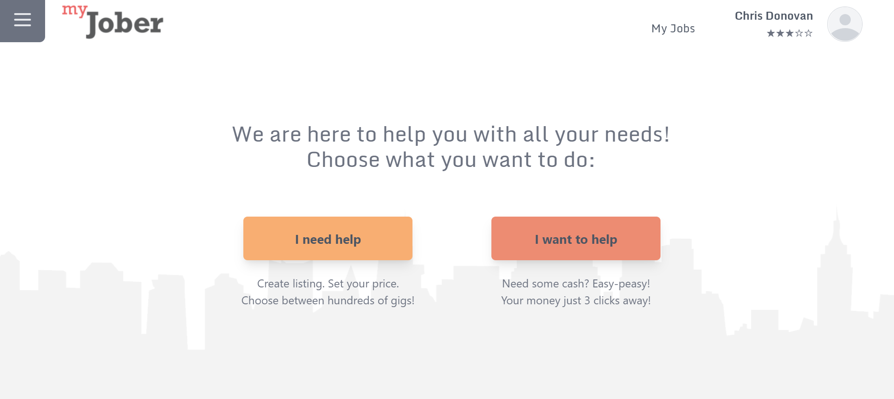

# myJobber

## Summary
AS a homeowner
I WANT to be able to search for any job that I need help with
SO THAT I can be able to hire someone to help me

# screenshot

## Deployed

https://shielded-chamber-45932.herokuapp.com/#/

## Code Repository

https://github.com/chdonovan/Jobs-posting

## Contributors
* Chris D.
* Nathaniel A.
* Kateryna B.
* Colin R.
* Jose M.
* Ronald M.
* Bayleigh W.

## Tools Used
    "autoprefixer": "^10.3.2",
    "if-env": "^1.0.4",
    "postcss": "^8.3.6",
    "tailwind": "^4.0.0",
    "tailwindcss": "^2.2.7"
    "apollo-server-express": "^2.11.0",
    "bcrypt": "^4.0.1",
    "express": "^4.17.1",
    "graphql": "^15.5.1",
    "jsonwebtoken": "^8.5.1",
    "mongoose": "^5.9.7",
    "nodemon": "^2.0.12"
    "@apollo/client": "^3.4.8",
    "@craco/craco": "^6.2.0",
    "@headlessui/react": "^1.4.0",
    "@heroicons/react": "^1.0.4",
    "@tailwindcss/forms": "^0.3.3",
    "@testing-library/jest-dom": "^5.14.1",
    "@testing-library/react": "^11.2.7",
    "@testing-library/user-event": "^12.8.3",
    "graphql": "^15.5.1",
    "jwt-decode": "^3.1.2",
    "react": "^17.0.2",
    "react-dom": "^17.0.2",
    "react-icons": "^4.2.0",
    "react-router-dom": "^5.2.0",
    "react-scripts": "4.0.3",
    "web-vitals": "^1.1.2"

